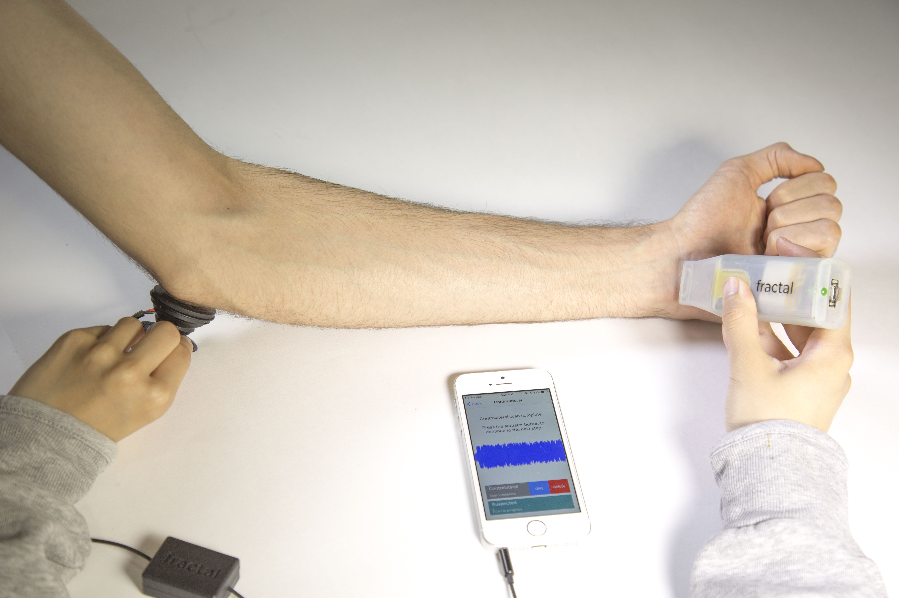

# Fractal
Fractal is a low-cost, automated method of detecting and monitoring fractures without the use of imaging.

[Emily Hunyh](https://www.linkedin.com/in/emily-h/) and [Paige Plander](https://www.linkedin.com/in/paigeplander/)

## Videos
- High fidelity prototype demo: https://youtu.be/3RDxQpScMgw
- Project overview narrated slides: https://youtu.be/Qr-Yz82CwG8

## Hardware
### Actuator
- Adafruit Feather Bluefruit 32uf
- Sound FX Board with Amp
- Bone Conducting Transducer

### Transducer
- Piezo contact mic
- 3.5mm Audio Jack
